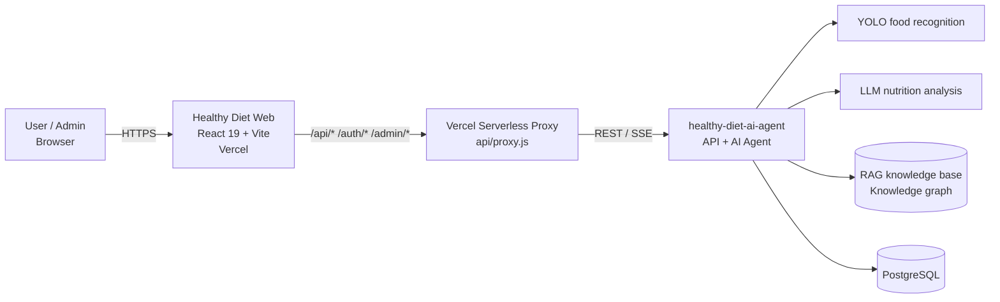

<div align="center">


# Healthy Diet Web

**An AI-powered personal nutrition platform: snap a meal, get instant nutrition analysis, and talk to an AI dietitian.**

[](https://healthy-diet-web.vercel.app)
[](https://react.dev)
[](https://vite.dev)
[](https://tailwindcss.com)
[](https://github.com/archie0732/healthy-diet-ai-agent)

[Live Demo](https://healthy-diet-web.vercel.app) · [Backend](https://github.com/archie0732/healthy-diet-ai-agent) · [Report an Issue](https://github.com/archie0732/healthy-diet-web/issues)

**English** · [繁體中文](README.zh-TW.md)

</div>

---

> [!IMPORTANT]
> **September 2026 architecture change: the backend now lives in [`archie0732/healthy-diet-ai-agent`](https://github.com/archie0732/healthy-diet-ai-agent).**
>
> Maintaining several projects in parallel (Rust API, YOLO inference service, Flutter app and agent service) became too costly. The Rust API in [`PU-Hub/healthy-diet`](https://github.com/PU-Hub/healthy-diet) was retired in September 2026, and every API is now served by **healthy-diet-ai-agent** (⭐ 751+).
> This repository (the web frontend) remains actively maintained and is the primary user interface for Healthy Diet.
>
> The planned **Flutter mobile app has been discontinued** because its maintainers could not commit the time. Mobile users are served by this project's responsive web UI instead.

## Table of Contents

- [Overview](#overview)
- [Features](#features)
- [Architecture](#architecture)
- [Tech Stack](#tech-stack)
- [Getting Started](#getting-started)
- [Environment Variables](#environment-variables)
- [Project Structure](#project-structure)
- [Testing](#testing)
- [Deployment](#deployment)
- [Project History](#project-history)
- [Related Projects](#related-projects)
- [Team](#team)

## Overview

Healthy Diet combines **computer vision (YOLO)**, **large language models (LLMs)** and **retrieval-augmented generation (RAG)**. Take a photo of your meal and you get food recognition, calorie and nutrient estimates, and AI nutrition advice tailored to your body metrics and medical history.

This repository is the Healthy Diet web frontend. It is built with React 19 and Vite, talks to the backend agent service through a Vercel serverless proxy, ships both a user app and a full admin console, and supports English and Traditional Chinese.

## Features

### For users

| Feature | Description |
| --- | --- |
| 📸 **Meal recognition** | Images are compressed client-side with the Canvas API before upload. A YOLO model detects each food item, estimates portion size and converts it to calories and nutrients. |
| 📊 **Health dashboard** | Automatic BMI / BMR calculation (with interactive flip cards showing the formulas), plus radar, pie and line charts for food-group balance, per-meal composition and AI score trends. |
| 💬 **AI dietitian** | Multiple chat rooms, conversation history, and Markdown / KaTeX math rendering. When the agent proposes a profile change, the user must approve it in a confirmation dialog (human-in-the-loop). |
| 🔎 **Knowledge search (RAG)** | Semantic search over a nutrition and health knowledge base, with previews of cited source documents. |
| 🕸️ **Knowledge graph** | Visual exploration of nutrition concepts and their relationships, each traceable back to its source evidence. |
| 📰 **Health news** | Automatically synced food and drug news with list and full-article views. |
| ⚙️ **Health profile** | Height, weight, medical history, allergies and dietary restrictions, all fed into the AI's evaluation. |
| 🌐 **Internationalization** | English and Traditional Chinese, switchable at runtime. |

### Admin console (`/admin`)

- **User management**: browse users and view their details.
- **Route controls**: turn expensive features such as image recognition and chat on or off at runtime, with no redeploy.
- **Announcements**: create, edit, publish and archive site-wide announcements.
- **RAG documents**: upload, preview, re-index and delete knowledge-base documents.
- **News tools**: trigger news syncs manually and debug them.

### Security and reliability

- JWT authentication (access and refresh tokens) with separate user and admin roles.
- Every API call goes through a same-origin serverless proxy, so the backend address is never exposed to the browser. Server-sent event (SSE) streaming is supported.
- The dashboard's agent health check is cached and gated, which avoids piling up requests while the backend cold-starts.

## Architecture



> Before September 2026, the `P → A` hop was handled by the Rust (Axum) API in `PU-Hub/healthy-diet`. It is now served entirely by `healthy-diet-ai-agent`.

## Tech Stack

| Area | Technology |
| --- | --- |
| Framework | React 19, Vite 8 |
| Routing | React Router 7 |
| Styling / UI | Tailwind CSS 4, shadcn/ui, Radix UI, Lucide Icons, Geist font |
| Data visualization | Recharts (LineChart / PieChart / RadarChart) |
| Content rendering | react-markdown, remark-gfm, remark-math, rehype-katex |
| i18n | Custom `LanguageContext` (`en` / `zh`) |
| Hosting | Vercel (static site + serverless function proxy) |
| Testing | Node.js built-in test runner (`node:test`) |

## Getting Started

### Prerequisites

- Node.js **20+**
- npm 10+
- A reachable backend: [`healthy-diet-ai-agent`](https://github.com/archie0732/healthy-diet-ai-agent), local or remote

### Install and run

```bash
git clone https://github.com/archie0732/healthy-diet-web.git
cd healthy-diet-web

npm install

# Point the app at your backend (see "Environment Variables")
echo "VITE_API_BASE=http://localhost:3000" > .env.local

npm run dev
```

Open <http://localhost:5173>. In development, Vite proxies `/api`, `/api/auth`, `/api/admin` and `/openapi.yml` to `VITE_API_BASE`, so you won't hit CORS issues.

### Scripts

| Command | Description |
| --- | --- |
| `npm run dev` | Start the dev server with HMR |
| `npm run build` | Build for production into `dist/` |
| `npm run preview` | Preview the production build locally |
| `npm run lint` | Run ESLint |

## Environment Variables

| Variable | Used by | Description |
| --- | --- | --- |
| `VITE_API_BASE` | Vite dev server, serverless proxy | Backend API base URL, e.g. `http://localhost:3000` or your production agent service URL. |
| `API_BASE` | Serverless proxy | Optional. Fallback when `VITE_API_BASE` is not set. |
| `TARGET_API_SERVER` | Serverless proxy | Optional. Second fallback. |

The proxy uses the first non-empty value in the order `VITE_API_BASE → API_BASE → TARGET_API_SERVER`.

## Project Structure

```text
healthy-diet-web/
├── api/
│   ├── proxy.js             # Vercel serverless proxy (with SSE streaming)
│   └── proxy.test.js
├── docs/                    # Frontend/backend integration handoffs and gap analysis
├── public/                  # Static assets (icons, team photos, demo video)
├── src/
│   ├── components/          # Layout, sidebar, profile-approval dialog, shadcn/ui components
│   ├── hooks/
│   ├── i18n/                # Language context and en / zh translations
│   ├── lib/                 # API client, auth session, chat, knowledge graph logic (with unit tests)
│   ├── views/               # Pages: Dashboard, Diet, Consult, News, Knowledge…
│   │   └── admin/           # Admin console pages
│   ├── App.jsx              # Routes and global state
│   └── main.jsx
├── vercel.json              # Route rewrites and function config
└── vite.config.js           # Dev proxy and path alias (@ → src)
```

## Testing

Tests use Node's built-in `node:test`, so no extra test framework is needed:

```bash
node --test
```

The suite covers API URL resolution, proxy forwarding and streaming, chat message handling, knowledge graph data transforms and the dashboard health-check cache. Please make sure both `npm run lint` and `node --test` pass before opening a pull request.

## Deployment

The project is built for **Vercel**:

1. Import this repository into Vercel and choose the **Vite** framework preset.
2. Under Project Settings → Environment Variables, set `VITE_API_BASE` to your production `healthy-diet-ai-agent` URL.
3. Once deployed, `vercel.json` automatically:
   - routes `/api/*`, `/api/auth/*`, `/api/admin/*` and `/openapi.yml` to `api/proxy.js` (60-second max duration, enough for long LLM responses);
   - falls back to `index.html` for every other path so client-side routing works.

## Project History

| When | Milestone |
| --- | --- |
| Early stage | Multi-repo architecture: Rust API ([`PU-Hub/healthy-diet`](https://github.com/PU-Hub/healthy-diet)) + YOLO inference + Flutter app + web frontend |
| 2026-05 | Web frontend adds AI agent chat rooms, announcements and the profile-approval flow |
| 2026-06 | News sync, RAG search, knowledge graph and admin console integrated |
| — | Flutter app discontinued because its maintainers could not commit the time; mobile is covered by the responsive web UI |
| **2026-09** | **Rust API retired; backend consolidated into [`healthy-diet-ai-agent`](https://github.com/archie0732/healthy-diet-ai-agent)** |

## Related Projects

| Repository | Status | Description |
| --- | --- | --- |
| [`archie0732/healthy-diet-web`](https://github.com/archie0732/healthy-diet-web) | 🟢 Active | Web frontend (this repository) |
| [`archie0732/healthy-diet-ai-agent`](https://github.com/archie0732/healthy-diet-ai-agent) | 🟢 Active | API and AI agent service (⭐ 751+) |
| [`PU-Hub/healthy-diet`](https://github.com/PU-Hub/healthy-diet) | ⚫ Unmaintained | Legacy Rust API, YOLO inference and Flutter app |

## Team

Healthy Diet is built by the PU-Hub team. Bug reports and suggestions are welcome in [Issues](https://github.com/archie0732/healthy-diet-web/issues), and pull requests are welcome too.

<div align="center">
<sub>If this project helps you, consider giving <a href="https://github.com/archie0732/healthy-diet-ai-agent">healthy-diet-ai-agent</a> a ⭐</sub>
</div>
