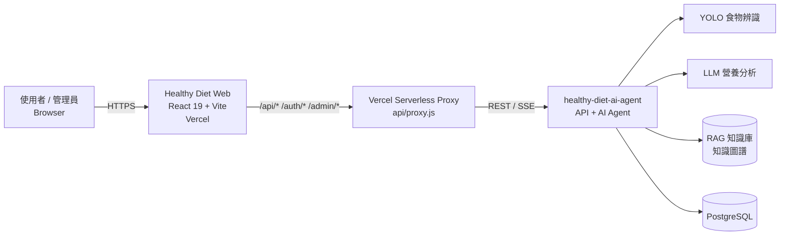

<div align="center">


# Healthy Diet Web

**AI 驅動的個人化飲食管理平台：拍照辨識、營養分析與 AI 營養師對話**

[](https://healthy-diet-web.vercel.app)
[](https://react.dev)
[](https://vite.dev)
[](https://tailwindcss.com)
[](https://github.com/archie0732/healthy-diet-ai-agent)

[線上展示](https://healthy-diet-web.vercel.app) · [後端服務](https://github.com/archie0732/healthy-diet-ai-agent) · [回報問題](https://github.com/archie0732/healthy-diet-web/issues)

[English](README.md) · **繁體中文**

</div>

---

> [!IMPORTANT]
> **2026-09 架構調整：後端已遷移至 [`archie0732/healthy-diet-ai-agent`](https://github.com/archie0732/healthy-diet-ai-agent)**
>
> 由於同時維護多個專案（Rust API、YOLO 推論服務、Flutter App、Agent 服務）的成本過高，原先位於 [`PU-Hub/healthy-diet`](https://github.com/PU-Hub/healthy-diet) 的 Rust API 已於 2026 年 9 月停止使用，所有 API 統一由 **healthy-diet-ai-agent**（⭐ 751+）提供。
> 本專案（Web 前端）持續維護，並作為 Healthy Diet 的主要使用者介面。
>
> 另外，原規劃的 **Flutter 行動 App 已停止開發**：相關維護者時間上無法配合，因此行動端需求統一由本 Web 專案的響應式介面（RWD）支援。

## 目錄

- [專案簡介](#專案簡介)
- [核心功能](#核心功能)
- [系統架構](#系統架構)
- [技術棧](#技術棧)
- [快速開始](#快速開始)
- [環境變數](#環境變數)
- [專案結構](#專案結構)
- [測試與品質](#測試與品質)
- [部署](#部署)
- [專案歷程](#專案歷程)
- [團隊](#團隊)

## 專案簡介

Healthy Diet 結合**電腦視覺（YOLO）**、**大型語言模型（LLM）**與**檢索增強生成（RAG）**，讓使用者只要拍下一張餐點照片，就能取得食物辨識、熱量與營養估算，以及依個人生理數據與病史量身打造的 AI 營養建議。

本 repository 是 Healthy Diet 的 Web 前端：以 React 19 + Vite 打造，透過 Vercel Serverless Proxy 連接後端 Agent 服務，提供使用者端與管理後台兩套完整介面，並支援中文 / 英文雙語。

## 核心功能

### 使用者端

| 功能 | 說明 |
| --- | --- |
| 📸 **餐點影像辨識** | 前端以 Canvas API 壓縮圖片後上傳，由 YOLO 模型框選食物、估算份量並換算熱量與營養素。 |
| 📊 **健康儀表板** | 自動計算 BMI / BMR（支援互動式公式翻牌），並以雷達圖、圓餅圖、折線圖呈現六大類食物比例、單餐結構與 AI 評分趨勢。 |
| 💬 **AI 營養師諮詢** | 多聊天室、歷史紀錄、Markdown / 數學公式（KaTeX）渲染；Agent 若建議更新個人檔案，會跳出確認對話框（human-in-the-loop）由使用者核准。 |
| 🔎 **知識檢索（RAG）** | 以語意搜尋查詢營養與健康知識庫，並可預覽引用來源文件。 |
| 🕸️ **知識圖譜** | 視覺化營養知識節點與關聯，可追溯每條關係的原始證據。 |
| 📰 **健康新聞** | 自動同步的食品 / 藥品相關新聞，含列表與全文閱讀頁。 |
| ⚙️ **個人健康檔案** | 設定身高體重、疾病史、過敏原與飲食禁忌，讓 AI 評估更精準。 |
| 🌐 **多語系** | 內建繁體中文與英文，可即時切換。 |

### 管理後台（`/admin`）

- **使用者管理**：檢視使用者清單與詳細資料。
- **路由開關（Route Controls）**：即時啟用 / 停用影像辨識、聊天等高成本功能，無須重新部署。
- **公告系統**：建立、編輯、發布與封存全站公告。
- **RAG 文件管理**：上傳、預覽、重新索引與刪除知識庫文件。
- **新聞工具**：手動觸發新聞同步與除錯。

### 安全與穩定性

- 以 JWT（Access / Refresh Token）驗證，使用者與管理員權限分離。
- 所有 API 請求皆經由同源 Serverless Proxy 轉發，不在瀏覽器暴露後端位址，並支援 SSE 串流回應。
- 儀表板 Agent 健康檢查具備快取與 ping gate，避免後端冷啟動時的重複請求。

## 系統架構



> 2026-09 以前，`P → A` 這一段是由 `PU-Hub/healthy-diet` 中的 Rust（Axum）API 承接；現已全面改由 `healthy-diet-ai-agent` 提供。

## 技術棧

| 分類 | 技術 |
| --- | --- |
| 框架 | React 19、Vite 8 |
| 路由 | React Router 7 |
| 樣式 / UI | Tailwind CSS 4、shadcn/ui、Radix UI、Lucide Icons、Geist 字型 |
| 資料視覺化 | Recharts（LineChart / PieChart / RadarChart） |
| 內容渲染 | react-markdown、remark-gfm、remark-math、rehype-katex |
| 國際化 | 自製 `LanguageContext`（`zh` / `en`） |
| 部署 | Vercel（靜態網站 + Serverless Function Proxy） |
| 測試 | Node.js 內建 test runner（`node:test`） |

## 快速開始

### 需求

- Node.js **20+**
- npm 10+
- 一個可連線的後端：[`healthy-diet-ai-agent`](https://github.com/archie0732/healthy-diet-ai-agent)（本機或遠端皆可）

### 安裝與啟動

```bash
git clone https://github.com/archie0732/healthy-diet-web.git
cd healthy-diet-web

npm install

# 設定後端位址（詳見下方「環境變數」）
echo "VITE_API_BASE=http://localhost:3000" > .env.local

npm run dev
```

開啟 <http://localhost:5173> 即可使用。開發模式下，Vite 會將 `/api`、`/api/auth`、`/api/admin` 與 `/openapi.yml` 代理至 `VITE_API_BASE`，因此不會遇到 CORS 問題。

### 常用指令

| 指令 | 說明 |
| --- | --- |
| `npm run dev` | 啟動開發伺服器（HMR） |
| `npm run build` | 產生正式版建置至 `dist/` |
| `npm run preview` | 在本機預覽正式版建置 |
| `npm run lint` | 執行 ESLint |

## 環境變數

| 變數 | 使用位置 | 說明 |
| --- | --- | --- |
| `VITE_API_BASE` | Vite dev server、Serverless Proxy | 後端 API 根網址，例如 `http://localhost:3000` 或正式環境的 Agent 服務網址。 |
| `API_BASE` | Serverless Proxy | 選用。`VITE_API_BASE` 未設定時的備援。 |
| `TARGET_API_SERVER` | Serverless Proxy | 選用。第三順位備援。 |

Proxy 會依 `VITE_API_BASE → API_BASE → TARGET_API_SERVER` 的順序取第一個有值的設定。

## 專案結構

```text
healthy-diet-web/
├── api/
│   ├── proxy.js             # Vercel Serverless Proxy（含 SSE 串流轉發）
│   └── proxy.test.js
├── docs/                    # 前後端整合交接文件與功能缺口分析
├── public/                  # 靜態資源（圖示、團隊照片、展示影片）
├── src/
│   ├── components/          # Layout、Sidebar、個人檔案核准對話框、shadcn/ui 元件
│   ├── hooks/
│   ├── i18n/                # 語系 Context 與 zh / en 翻譯
│   ├── lib/                 # API client、驗證 session、聊天、知識圖譜等邏輯（含單元測試）
│   ├── views/               # 各頁面：Dashboard、Diet、Consult、News、Knowledge…
│   │   └── admin/           # 管理後台頁面
│   ├── App.jsx              # 路由與全域狀態
│   └── main.jsx
├── vercel.json              # 路由改寫與 Function 設定
└── vite.config.js           # 開發代理與路徑別名（@ → src）
```

## 測試與品質

專案使用 Node.js 內建的 `node:test`，無需額外測試框架：

```bash
node --test
```

測試涵蓋 API URL 解析、Serverless Proxy 轉發與串流、聊天訊息處理、知識圖譜資料轉換、儀表板健康檢查快取等核心邏輯。提交 PR 前請確認 `npm run lint` 與 `node --test` 皆通過。

## 部署

本專案針對 **Vercel** 設計：

1. 在 Vercel 匯入此 repository，Framework Preset 選擇 **Vite**。
2. 於 Project Settings → Environment Variables 設定 `VITE_API_BASE`，指向 `healthy-diet-ai-agent` 的正式網址。
3. 部署完成後，`vercel.json` 會自動：
   - 將 `/api/*`、`/api/auth/*`、`/api/admin/*`、`/openapi.yml` 轉送至 `api/proxy.js`（最長執行 60 秒，支援 LLM 長回應）；
   - 其餘路徑回退至 `index.html`，支援 SPA 前端路由。

## 專案歷程

| 時間 | 里程碑 |
| --- | --- |
| 初期 | 多專案架構：Rust API（[`PU-Hub/healthy-diet`](https://github.com/PU-Hub/healthy-diet)）+ YOLO 推論 + Flutter App + Web 前端 |
| 2026-05 | Web 前端導入 AI Agent 聊天室、公告系統與個人檔案核准流程 |
| 2026-06 | 串接新聞同步、RAG 搜尋、知識圖譜與管理後台 |
| — | Flutter App 因維護者時間無法配合而停止開發，行動端改由 Web RWD 支援 |
| **2026-09** | **Rust API 停用，後端統一遷移至 [`healthy-diet-ai-agent`](https://github.com/archie0732/healthy-diet-ai-agent)** |

## 相關專案

| Repository | 狀態 | 說明 |
| --- | --- | --- |
| [`archie0732/healthy-diet-web`](https://github.com/archie0732/healthy-diet-web) | 🟢 維護中 | Web 前端（本專案） |
| [`archie0732/healthy-diet-ai-agent`](https://github.com/archie0732/healthy-diet-ai-agent) | 🟢 維護中 | API 與 AI Agent 服務（⭐ 751+） |
| [`PU-Hub/healthy-diet`](https://github.com/PU-Hub/healthy-diet) | ⚫ 已停止維護 | 舊版 Rust API、YOLO 推論與 Flutter App |

## 團隊

Healthy Diet 由 PU-Hub 團隊開發。歡迎透過 [Issues](https://github.com/archie0732/healthy-diet-web/issues) 回報問題或提出建議，也歡迎發送 Pull Request。

<div align="center">
<sub>如果這個專案對你有幫助，歡迎到 <a href="https://github.com/archie0732/healthy-diet-ai-agent">healthy-diet-ai-agent</a> 給一顆 ⭐</sub>
</div>
